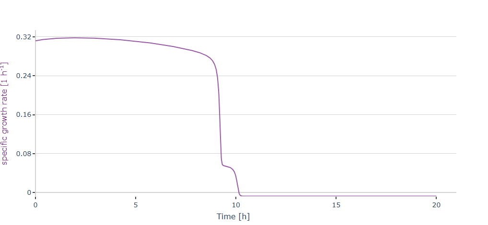

# Template Generator and Library of Models
This projects aims to enable all users to create a standardize code for simple macrokinetik models and let them generated plots.

This is an example for a generated plot using the template generated by the tempalte generator:



If you use this **Template Generator** you will only have to understand how the code works once, then you can concentrate on the models.

This projects also aims to create a Library of models created with this **Template Generator**.

If you want to use the **Template Generator** locally please read the Quick start guide.

!!! **IMPORTANT**
If you are reading this in **Jupyter light** just open the template generator folder and read the **README** there.

---
Go to **`Library_of_Models`**  to find the Models.

Go to **`Tempalte_Generator`** to create new Models using the Template Generator

Currently, there are 2 working Model:

-Overflow model of Xu et al. 1999 

-Acetate cycling model of Anane et al. 2017 (also with a Paper comparison version)

For further information on how the Template Generator works, read the Readme file in the **`Tempalte_Generator`** folder.


cloud link to project (you will find the paper here):

https://tubcloud.tu-berlin.de/f/4335746014

project currently as part of the Bachelor Thesis of Matteo Di Fiore :)

---

# Bioprocess Modelling Template – Quick Start Guide

Welcome! This guide will take you through all the steps required to get the Template Generator running on your computer, from cloning the repository to running the Jupyter Notebook.

---
## Recommended AI Prompt – Bioprocess Modelling Template Setup

If this is your first time working with **Git**, **Python**, or **Jupyter Notebooks**, copy and paste the following prompt into an AI assistant:

**Prompt:**
```
I need help setting up and running the Bioprocess Modelling Template from TU Berlin (a Jupyter Notebook based project, that is stored in git).

Here’s what I want to do:
1. Clone the repository:
   https://git.tu-berlin.de/bvt-htbd/public/bioprocess-modelling-template.git
2. Download the right packages to run the Jupyter Notebooks.
3. Launch and run the `Template_Generator.ipynb` Jupyter Notebook.
4. Understand how to generate and explore the simulation templates.

Please walk me through each step interactively.  
I’m a beginner, so explain what each command does and how to verify that things are working correctly.  
Ask me what system im using.
Ask me if i ever coded before.
If yes ask me with which plattform i coded. Then decide if i can use it to open a Jupyter Notebook.
If i never coded or the plattform is not compatible with jupyter notebooks, advise me to download Pycharm. For doing it give me a detailed instruction.
Then guide me throught the steps of cloning the repo and opening the jupyter notebook.
Also ask me the folder path where I want to store the cloned git repo (make a recommandation, but say that it can be saved wherever i want).
To run the Tempalte Generator some packages must be installed. These packages (requirements) are saved as .txt or .yml file. 
They are stored inside the folder Requirements that is inside Readme_files that is inside the Template_generator folder.
Guide me trough installing the requirements.txt file.
Then tell me to open the Template_generator Notebook that is inside the Tempalte_generator folder and tell me to try to run the first cell with all the improts.
If i have problems with running the first cell after installing the packages through the requiremnts.txt file, guide me through installing the requirements_fixed.txt file. 
If i tell you that I managed to run the first three cells without encountering any errors tell me to read the Readme file located in the Template_generator folder.
Tell me also that if I do not understand something about that readme, i can ask you. 
```
---
## Step by Step Guide
## 1️⃣ Clone the Repository

Here are two options of how to clone the repo.

### Option A: Using a Terminal

1. Open Git Bash or Terminal on macOS/Linux or open cmd.exe in Windows. You can also use something different like the Anaconda Terminal.

2. Navigate to the folder where you want to store the project.
Example:

   ```bash
   cd C:\Users\YourName\Documents\Bioprocess_Modelling
   ```

3. Clone the repository:

   ```bash
   git clone https://git.tu-berlin.de/bvt-htbd/public/bioprocess-modelling-template.git
   ```

4. Navigate into the project folder:

   ```bash
   cd bioprocess-modelling-template
   ```

### Option B: Using PyCharm

1. Open PyCharm.
2. Go to `File > New Project > Get from Version Control`.
3. Select **Git** and paste the repository URL:   

[https://git.tu-berlin.de/bvt-htbd/public/bioprocess-modelling-template.git](https://git.tu-berlin.de/bvt-htbd/public/bioprocess-modelling-template.git)

    

4. Choose your local path and click **Clone**. PyCharm will open the project.

---

## 2️⃣ Set Up Your Python Environment

The Template Generator requires some Python packages. These are stored in:

```
Template_generator/Readme_files/Requirements/
├── requirements.txt
├── requirements_fixed.txt
├── environment.yml
└── environment_fixed.yml
```

* `requirements.txt` / `environment.yml`: minimal version-free dependencies
* `requirements_fixed.txt` / `environment_fixed.yml`: specific fixed versions

### Option A: Using Conda (Recommended)

1. Open **Anaconda Prompt** or **Terminal**.
2. Navigate to the project folder:

```bash
cd bioprocess-modelling-template
```

3. Create the environment from the YAML file:

```bash
conda env create -f Template_generator/Readme_files/Requirements/environment.yml
```

> If you run into trouble with the packages try the fixed versions:

```bash
conda env create -f Template_generator/Readme_files/Requirements/environment_fixed.yml
```

4. Activate the environment:

```bash
conda activate env_py312
```

5. Verify installation:

```bash
conda list
```

---

### Option B: Using pip + venv (Without Conda)

1. Open **Git Bash**, **cmd**, **PowerShell**, or **Terminal**.
2. Navigate to the project folder:

```bash
cd bioprocess-modelling-template
```

3. Create a virtual environment:

```bash
python -m venv venv
```

4. Activate the environment:

* Windows (cmd):

```cmd
venv\Scripts\activate
```

* Windows (PowerShell):

```powershell
.\venv\Scripts\Activate.ps1
```

* macOS/Linux:

```bash
source venv/bin/activate
```

5. Install dependencies:

```bash
pip install -r Template_generator/Readme_files/Requirements/requirements.txt
```

> Or, for fixed versions:

```bash
pip install -r Template_generator/Readme_files/Requirements/requirements_fixed.txt
```
---
Verify versions in the Notebook if you want like this:

```python
import numpy, scipy, matplotlib, plotly, ipywidgets, nbformat, IPython, pandas
print("NumPy:", numpy.__version__)
print("SciPy:", scipy.__version__)
print("Matplotlib:", matplotlib.__version__)
print("Plotly:", plotly.__version__)
print("ipywidgets:", ipywidgets.__version__)
print("nbformat:", nbformat.__version__)
print("IPython:", IPython.__version__)
print("Pandas:", pandas.__version__)
```

---

## 3️⃣ Launch Jupyter Notebook

1. Make sure the environment is **activated**.
2. Launch Jupyter Notebook with Anaconda (or open it inside Pycharm or something similar):

```bash
jupyter notebook
```

3. Open `Template_Generator.ipynb` inside the `Template_generator/` folder.
4. Run the first three cells of the notebook to see if there are some errors.

---

## 4️⃣ Using the Template Generator Notebook

Read the Readme file in the Template_generator folder for further information.

---

## 5️⃣ Explore the Folder Structure

```
bioprocess-modelling-template/
├── Template_generator/
│   ├── class_fedbatch.py               # class needed for the generated template
│   ├── class_plot.py                   # class needed for the generated template
│   ├── class_allthedata.py             # class needed for the generated template
│   ├── markdownd_generation.py         # class needed for the generated template
│   ├── subbox_module.py                # class needed in the Template generator for the UI
│   ├── Template_Generator.ipynb        # Main interactive notebook
│   ├── README.MD                       # Readme for the Template generator
│   ├── Readme_files/
│   │   ├── Requirements/
│   │   │   ├── requirements.txt
│   │   │   ├── requirements_fixed.txt
│   │   │   ├── environment.yml
│   │   │   └── environment_fixed.yml
│   │   └── Pictures_for_Readme/        # Here the Pictures for the Readme of the Template generator are stored
│   └── your_model_name/                # Your generated template
├── Library_of_Models/                  # Generated models from Template Generator (Archive)
└── README.MD                           # This Readme
```

---