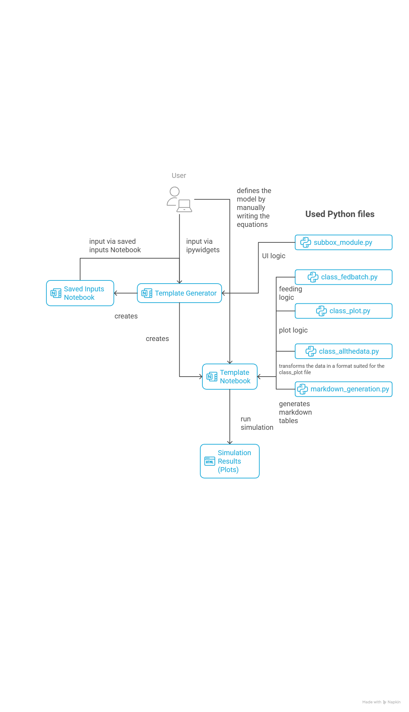
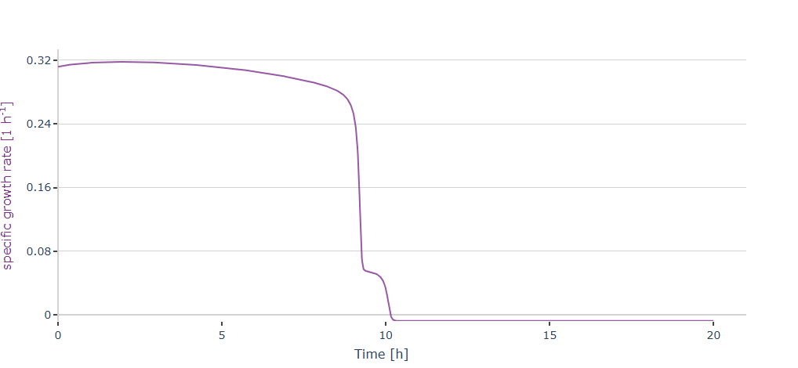
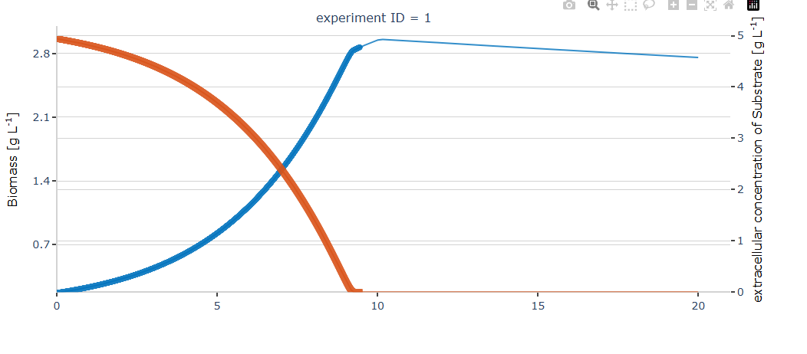

#  Template Generator - Guide

👨‍💻 Author: **Matteo Di Fiore** 😊 

---

## 🚀 Welcome!

Welcome to the **Template Generator** — a simple and interactive tool designed to help you quickly generate code for models with ease.  
The Template Generator is aimed at macrokinetik models, that uses algebraic and differential equations.

The following guide will help you understand how the Template generator works and how to use the generated Template.

---
# Workflow


## 📑 Table of Contents
- [📖 How to Use](#-how-to-use)
  - [1. Using the ipywidgets Interface](#1--using-the-ipywidgets-interface-)
    - [Model information](#Model-information)
    - [Variables](#Variables)
    - [Inputs](#inputs)
    - [Parameters](#parameters)
    - [Constants](#constants)
    - [Rates](#rates)
    - [Feed Parameters](#feed-parameters)
    - [Feeding functions](#feeding-functions)
    - [Confirm](#confirm)
    - [Differential Equations](#differential-equations)
    - [Save Inputs](#save-inputs)
    - [Restart Button](#restart-button)
  - [2. Loading Example Templates](#2--loading-example-templates-)
  - [3. Using a Template Notebook](#3--using-a-template-)
- [How to modify the saved inputs notebook](#-how-to-modify-the-saved-inputs-notebook)
- [✅ After Creating Your Template](#-things-to-do-after-creating-your-template)
- [Structure and Functionality of the Generated Template](#structure-and-functionality-of-the-generated-jupyter-notebook-template)
  - [How does the template do a simulation?](#understanding-the-simulation-workflow)
- [Structure and Functionality of the template generator](#structure-and-functionality-of-the-template-generator)
- [👾 I want to create my own Version of the Tempalte or tune it](#creating-your-own-template-versions)
- [Checking out the Plotter Class (PlotPlotly)](#plotplotly---bioprocess-data-visualization)
  - [How to make a plot with simulation and data](#adding-measured-data)

---

# 📖 How to Use

I hope you previously read the main Readme, so you should have installed all the needed packages and opened the **`Template_generator`** Notebook.

If all required packages are installed, run the **first 3 cells**:  
- Import cell  
- Long Template Generator cell  
- Small cell  

Now you can choose **3 different ways** to create Templates for your model.
At the end you will have one notebook with your Model and one notebook that saves your inputs to create new models.

---

## 1. 🖥 Using the ipywidgets Interface  

**Best option if you’re new to coding or want to quickly create a small model.**

After running the first three cells, you should see something like this (example from Pycharm in dark mode):  

  

For each needed input, there is a dedicated box with an explanation and a common log.  
The program will guide you step-by-step through the required inputs.
On the right you can also see the Readme section of the required input. If you forgot what you will read here, no problem just read it again while you do your inputs.

Let's go through every required input, to see why and for what it's needed.

---


### Model Information
In this box you will be asked three inputs:

**Model Name**

Enter the name of your model here.  
This name will be used to name your generated template notebook file.  
It will also appear as the title at the top of the generated notebook.

**Example Input:**  
> Model for Overflow in E.coli

---

**Model Description and Assumptions**

Use this text box to describe your model in detail.  
Explain what the model represents, how it works, and include any important **assumptions** you made while building it.  
This information will be included in the *Description* section of the generated notebook.

**Example Input:**  
> This model describes batch fermentation kinetics assuming constant temperature and complete mixing. The growth rate follows Monod kinetics.

---

**Model Goal**

Write down the goal or purpose of your simulation.  
This helps clarify what you want to achieve with the generated notebook (for example, model validation, parameter estimation, or comparison with experimental data).  
The goal will also appear in the *Description* section of the notebook.

**Example Input:**  
> Compare measured batch data with simulated results to validate model accuracy.

---
When you are finished with writing the needed inputs for the Model name etc., you can press confirm.
By doing so, the inputs are saved, and you will see a log notification with your given inputs.

---
### Variables
In this box you will be asked three inputs:

**Variable Name**

Enter the name of your variable here.  
This name will be used inside the generated template in the variable dictionary as a key (all the other things will be attributed to this name).
A variable in this template generator is always associated with a differential equation.

*Important !*

When you will write your model and want to refer to your variable you will use an abbreviation.
This abbreviation will be asked later on in the UI.
It is also important to note, that for every variable you write, you will be asked for a differential equation.
That's why if you want a differential equation of something, that something should be added as a variable (or later by hand).

**Example Input:**  
> Biomass

---

**Unit**

Use this text box to give your variable a unit.  
This unit will also be displayed in the plots when the differential equation for the variable is solved.
If you write the unit with a / it will be automatically converted to ^-1. 

For example `g/L` will be visualized as `g L⁻¹` in the final plot.

**Example Input:**  
> g/L 

---

**Description**

Write down a longer description of your variable. It should contain more information about it. 

This will be put together with the unit as the name to be displayed in the final plots.

**Example Input:**  
> Biomass concentration of e.coli 

---

When you filled out all required text boxes, you can press add variable to save the given inputs. The variable name will then be clear and a log message will appear, saying which variable you added.
If you don't have any more variables to add, you can press I'm finished.
By pressing Back, you can delete the latest entry you made.

---

### Inputs
In this box you will be asked three inputs:

**Input Name**

Enter the name of your input here.  
This name will be used inside the generated template in the input dictionary as a key (all the other things will be attributed to this name).

*Important !*

By using the Template generator you automatically have `Feed` as a default input.
You don't need to rewrite it.

**Example Input:**  
> Oxygen

---

**Unit**

Use this text box to give your input a unit.  
The unit for the input is purely for standardization of the code, but not for the predefined input `Feed`.
The unit for the Feed will be displayed in the same way as the variables.
That means description + unit to be used as a title for the plot (if needed).
But you have to change the unit and description manually in the generated template notebook to adjust it to your needs.

**Example Input:**  
> L/s 

---

**Description**

Write down a longer description of your input. It should contain more information about it. 


**Example Input:**  
> Oxygen flow in the bioreactor 

---

When you filled out all required text boxes, you can press add input to save the given inputs. The input name will then be clear and a log message will appear, saying which input you added.
If you don't have any more inputs to add, you can press I'm finished.
By pressing Back, you can delete the latest entry you made.

---
### Parameters
In this box you will be asked three inputs:

**Parameter Name**

Enter the name of your parameter here.  
This name will be used inside the generated template in the parameter dictionary as a key (all the other things will be attributed to this name).

*Important !*

The name you will write here will also be the variable which will stand for you parameter.
You should try to give it a short and distinct name.
Parameters and constant are treated in the same way inside the generated template notebook.
Both will be used as constants.
It is your choice what you will define as a constant or a parameter.

**Example Input:**  
> q_s_max

---

**Unit**

The unit given is just for documentation of the code, it has no real impact on it.
But you should be really clear with it (maybe you do some unit conversions inside your formulas).

**Example Input:**  
> g/g/h 


---

**Description**

Write down a longer description of your parameter. It should contain more information about it. 


**Example Input:**  
> maximum substrate uptake rate 

---

When you filled out all required text boxes, you can press add parameter to save the given inputs. The parameter name will then be clear and a log message will appear, saying which parameter you added.
If you don't have any more parameters to add, you can press I'm finished.
By pressing Back, you can delete the latest entry you made.

---

### Constants
In this box you will be asked three inputs:

**Constant Name**

Enter the name of your constant here.  
This name will be used inside the generated template in the constant dictionary as a key (all the other things will be attributed to this name).

*Important !*

The name you will write here will also be the variable which will stand for you constant.
You should try to give it a short and distinct name.
Parameters and constant are treated in the same way inside the generated template notebook.
Both will be used as constants.
It is your choice what you will define as a constant or a parameter.

**Example Input:**  
> K_s

---

**Unit**

The unit given is just for documentation of the code, it has no real impact on it.
But you should be really clear with it (maybe you do some unit conversions inside your formulas).

**Example Input:**  
> g/L 


---

**Description**

Write down a longer description of your constant. It should contain more information about it. 


**Example Input:**  
> substrate inhibition constant 

---

When you filled out all required text boxes, you can press add constant to save the given inputs. The constant name will then be clear and a log message will appear, saying which constant you added.
If you don't have any more constants to add, you can press I'm finished.
By pressing Back, you can delete the latest entry you made.

---

### Rates
In this box you will be asked three inputs:

**Rate Name**

Enter the name of your rate here.  
This name will be used inside the generated template in the rate dictionary as a key (all the other things will be attributed to this name).

*Important !*

The name you will write here will also be the variable which will stand for you rate.
You should try to give it a short and distinct name.
For each rate you write the generated template will ask you to write an algebraic equation for it.

**Example Input:**  
> q_s

---

**Unit**

The unit given is **not** just for documentation of the code, it has will be used in the plots.
If you write the unit with a / it will be automatically converted to ^-1. 

For example `g/L` will be visualized as `g L⁻¹` in the final plot.

**Example Input:**  
> g/g/h 


---

**Description**

Write down a longer description of your rate. It should contain more information about it. 

This will be put together with the unit as the name to be displayed in the final plots. 


**Example Input:**  
> substrate uptake rate (q_s) 

---

When you filled out all required text boxes, you can press add rate to save the given inputs. The rate name will then be clear and a log message will appear, saying which rate you added.
If you don't have any more rates to add, you can press I'm finished.
By pressing Back, you can delete the latest entry you made.

---

### Feed Parameters
In this box you will be asked five inputs:

**Constant feed start**

Enter the time (in hours) when your constant feed should start.

*Important !* 

You can change the value later on in the code manually and it is optional.

**Example Input:**  
> 12

---

**Feed variable name**

Enter the variable which should be used for the Feed.

*Important !*

F is set as a default, because it is used most of the time.

**Example Input:**  
> F

---

**Cultivation end**

Enter the time (in hours) when your simulation should end.

*Important !*

You can change this value manually in the code later on.

**Example Input:**  
> 24

---

**Feed concentration**

Enter the Feed concentration you want to use in g/L or change the unit for the Feed manually in the input dictionary and give a number in a different unit.

**Example Input:**  
> 520 

---

**Fedbatch start**

Enter the time (in hours) when fedbatch should start. You can also leave it empty if you don't want to feed via time. You can also have a feeding based on the substrate (this will be explained more in detail later).


**Example Input:**  
> 6

---

When you filled out all required text boxes, you can press submit parameters.
By pressing back you delete all your entries (given for the Feed parameters).

---

### Feeding functions
In this box you have to decide if you want predefined feeding functions or not.

By pressing no you have to write your own feeding functions later on in the generated template notebook.

By pressing yes you can use this function:

The following equations describe the **exponentially increasing feed profile** used in fed-batch simulations.

**Initial Feed Rate**

F0 = (V0 · self.X_fedbatch_start · mu_set) / (Y_XS · S_feed)

$$
F_0 = \frac{V_0 \cdot X_{\text{fedbatch_start}} \cdot \mu_{\text{set}}}{Y_{XS} \cdot S_{\text{feed}}}
$$

**Exponential Feed Rate**

F = F_0 · exp(mu_set · (t - self.t_s))

$$
F = F_0 \cdot e^{\mu_{\text{set}} \cdot (t - t_s)}
$$

Parameter Definitions

| Variable used in the code   | Description | Typical Unit |
|:----------------------------|:-------------|:-------------|
| \( F_0 \)                   | Initial feed rate | L·h⁻¹        |
| \( F \)                     | Feed rate at time *t* | L·h⁻¹        |
| \( V_0 \)                   | Initial reactor volume | L            |
| \( self.X_fedbatch_start \) | Biomass concentration at start of fed-batch phase | g·L⁻¹        |
| \( mu_set \)                | Specific growth rate setpoint | h⁻¹          |
| \( Y_XS \)                  | Biomass yield on substrate | g·g⁻¹ |
| \( S_feed \)                | Substrate concentration in feed | g·L⁻¹        |
| \( t \)                     | Time | h            |
| \( self.t_s \)              | Start time of feed phase | h            |

---

 **Note:**  
This exponential feed strategy maintains a **constant specific growth rate** mu_set by exponentially adjusting the substrate feed rate \( F \) as the biomass increases.
If you want to use this equation make sure to name your variable with the exact same name, or change the names of the variable in the equation to the one you use.
---

### Confirm

By pressing confirm and continue you can go on to the next page.
There you will be asked about what variable you want to use in the code of the generated template notebook for your given variables.
That's why it is important to be sure to have given all needed inputs before continuing.

---

### Differential Equations

You will see as many text boxes as many variables you added before.
Now you have to attribute to each variable a name for variable which is used in the code of the generated template notebook.
This given name will also be used to create the left hand side of the differential equation of that variable.

**Example:**

If you have given biomass as a variable you could use `X` as a variable name inside the code. Then you could do your equations by calling biomass with `X`.
The left hand side will also be generated.
If you use `X` for biomass it will look like this: `dXdt`.
Another example would be to use `S` for the variable substrate. Then you could use it in equations for the substrate uptake rate like this:
`q_s = q_s_max * S / (K_s +S)`. The left hand side of the differential equation would look like this: `dSdt`.

---

By clicking back you delete the latest entry you made for this section. But you are not able to go back to the last screen.
By clicking on submit, your names will be saved, and you continue to the last screen.

---
### Save Inputs

In this box you have to decide if you want to save your inputs or not.
If you save your inputs a different notebook called `saved_inputs_for_your_model_name.ipynb` will be created, where your inputs are stored.
This file can be used to create the exact same template you just created with your inputs (this process will be described later in detail).

You can also press back if you want to change something inside the differential equations section. 

---

### Restart Button

You can find a restart button on the bottom of the generated boxes. If you press it you can restart the UI and start to make your inputs again.

---

## 2. 📂 Loading Example Templates  

There are two code cells for using this feature.
The first is:
```python
model.mock_data()        # This loads the dummy values
model.create_save_inputs_function() #creates a dummy template and notebook out of it
```

This option loads **dummy data** (from an Overflow model) into the template generator and generates a saved inputs notebook + template notebook automatically.  

**Use case:** Quickly test with built-in values and generate a starting template.  

---
### `Template_Example`
The second cell is the following:
```python
model.example_template()
model.create_notebook()  # creates a ready to use notebook based on predefined data
```
By running this cell you will get a ready to use notebook called `Template_Example.ipynb` with prefilled equations.

**You should take a look at it if it's your first time using the template generator.**

---

## 3. 📝 Using a Template  

If you already have coding experience and a large model, the quickest way is to **modify an existing saved inputs notebook** and load it:  

```python
model.load_mock_data_from_notebook("saved_inputs_for_Overflow_test.ipynb") # replace with the name of your saved inputs
model.create_notebook()  # Creates a notebook from loaded data
```
You have to replace the name with the file path relative to the template generator.
For example if your saved input notebook is in a folder named model inside the folder template_generator(where the template generator is) you have to write:
"model/saved_inputs_for_model.ipynb".

---

# 🧩 How to Modify the Saved Inputs Notebook

The **Saved Inputs Notebook** contains all the information required to recreate a template notebook also with the equation already in it.  
This file is automatically generated by the Template Generator and can later be **loaded again** to rebuild or modify a template notebook (see above).

---

## 📁 Structure Overview

All input data is stored in **Python dictionary format** inside the notebook.  
Each major section corresponds to one model component:

| Section | Description                                                                 |
|:--------|:----------------------------------------------------------------------------|
| `self.variables` | Defines all dynamic model variables (e.g. Biomass, Substrate, Volume)       |
| `self.inputs` | Defines process inputs (e.g. Feed flow, oxygen input)                       |
| `self.parameters` | Defines model parameters that can be used in the model equations            |
| `self.constants` | Defines fixed constants used in the model equations                         |
| `self.rates` | Defines rate equations (specific rates like growth, substrate uptake, etc.) |
| `self.dif_equations` | Defines differential equations for each variable                            |
| `self.feed_params` | Defines feed and process-related conditions                                 |
| `self.model_name`, `self.model_description`, `self.model_goal` | Metadata for documentation and clarity                                      |

---

## ⚙️ Example Format (complex one used in the generation of the pre-filled example)

```python
self.variables = {
    'Biomass': {
        'description': 'Biomass concentration',
        'unit': 'g/L',
        'initial_value': 0.0358,
        'boundaries': [None, None],
        'estimable': None,
        'weight': None,
        'plotting': {'plot': None, 'range_fedbatch': None},
        'volume_related': None,
        'conversion_factor': None
    },
    'Substrate': {
        'description': 'Substrate',
        'unit': 'g/L',
        'initial_value': 5,
        'boundaries': [None, None],
        'estimable': None,
        'weight': None,
        'plotting': {'plot': None, 'range_fedbatch': None},
        'volume_related': None,
        'conversion_factor': None
    },
    'Volume': {
        'description': 'Volume',
        'unit': 'L',
        'initial_value': 10,
        'boundaries': [None, None],
        'estimable': None,
        'weight': None,
        'plotting': {'plot': None, 'range_fedbatch': None},
        'volume_related': None,
        'conversion_factor': None
    }
}

self.inputs = {
    'Feed': {
        'description': 'Feed volume',
        'unit': 'L',
        'concentration': 0.0,
        'plotting': {'plot': None, 'stem': None, 'range': [None, None]}
    }
}

self.parameters = [
    {
        'name': 'my_set',
        'unit': '1/h',
        'description': 'Set specific growth rate',
        'values': {'value': 0.3, 'min': None, 'max': None, 'vary': None}
    },
    {
        'name': 'qm',
        'unit': 'g/g/h',
        'description': 'Maintenance coefficient',
        'values': {'value': 0.04, 'min': None, 'max': None, 'vary': None}
    }
]

self.constants = [
    {'name': 'Y_XS', 'value': '0.56', 'unit': 'g/g', 'description': 'Biomass yield coefficient on substrate'},
    {'name': 'qsmax', 'value': '1.6', 'unit': 'g/g/h', 'description': 'Maximum specific substrate uptake rate'},
    {'name': 'Ks', 'value': '0.05', 'unit': 'g/L', 'description': 'Saturation constant for substrate'}
]

self.rates = [
    {'name': 'qs', 'unit': 'g/g/h', 'description': 'Specific substrate uptake', 'equation': 'qsmax * S / (S + Ks)'},
    {'name': 'my', 'unit': '1/h', 'description': 'Specific growth rate', 'equation': '(qs - qm) * Y_XS'}
]

self.dif_equations = [
    {'variable': 'X', 'diffeq': '(-F / V + my) * X # Biomass balance'},
    {'variable': 'S', 'diffeq': '-F / V * (S - S_feed) - qs * X # Substrate balance'},
    {'variable': 'V', 'diffeq': 'F # Volume balance'}
]

self.feed_params = {
    'fedbatch_start': '6',
    'cultivation_end': '20',
    'constant_feed_start': '12',
    'feed_var': 'F',
    'exp_feed_eq': '# Put here your exponential feeding equation(s)',
    'constant_feed_feed_eq': '0.1 # Put here your constant feed equation(s)',
    'feed_conc': '500'
}

self.model_name = 'Template_Example'
self.model_description = (
    "This is a simple template example with a working model based on Biomass, Substrate and Volume. "
    "You can expand it by adding more variables, parameters, and equations to build your own kinetic model."
)
self.model_goal = 'Example use for Template ready to use (already filled out). The example starts as a batch simulation.'
```

---

##  What You Can Modify

Below is a guide to what you **can** and **should not** change.

### ✅ Allowed Modifications

| Section | What you can edit |
|:--------|:------------------|
| **`self.variables`** | Add or remove variables. Change `description`, `unit`, and `initial_value`. |
| **`self.inputs`** | Add new process inputs (e.g., "Air", "Base"). Change `description`, `unit`, or `concentration`. |
| **`self.parameters`** | Change parameter `value` or add new parameters with the same structure. |
| **`self.constants`** | Add new constants or adjust `value` and `description`. |
| **`self.rates`** | Modify or extend equations (make sure all referenced variables and constants exist). |
| **`self.dif_equations`** | Edit the right-hand side of differential equations or add new ones. |
| **`self.feed_params`** | Adjust feed start, end, and equations to define process strategy. |
| **`self.model_name`, `self.model_description`, `self.model_goal`** | Update text for clarity and documentation. |

---

### ⚠️ Do Not Modify

Some entries act as **standard placeholders** and should remain unchanged:

| Section | Entries that must remain as-is |
|:--------|:-------------------------------|
| **Variables** | `'boundaries': [None, None]`, `'estimable': None`, `'weight': None`, `'plotting': {'plot': None, 'range_fedbatch': None}`, `'volume_related': None`, `'conversion_factor': None` |
| **Inputs** | `'plotting': {'plot': None, 'stem': None, 'range': [None, None]}` |
| **Parameters** | Inside `'values'`: `'min': None`, `'max': None`, `'vary': None` (only `'value'` can be changed) |

These fields are used internally by the Template Generator and are automatically filled later.

---

## 🤖 Universal AI Prompt – Generate a Saved Inputs Notebook

Use this prompt in ChatGPT (or another AI assistant) to automatically create or modify a **Saved Inputs Notebook** for your own bioprocess model.  
This prompt ensures that the generated code follows the correct structure for the template generator and can be directly pasted into a Jupyter Notebook.

---

## Prompt
```
I want to create or modify a Saved Inputs Notebook for the Bioprocess Modelling Template (TU Berlin).  
This notebook defines all input dictionaries required to generate a model-based simulation template.

Please generate or update the file based on a structure i will tell you.

Formatting Requirements when generating or updating the file:

1. Follow the exact dictionary-based structure used in the Saved Inputs Notebook.  
2. Keep all required keys and placeholder fields, even if values are not defined. 
These are the placeholders to Not Modify

Some entries act as standard placeholders and should remain unchanged (the following you should read it as a markdown table):

| Section | Entries that must remain as-is |
|:--------|:-------------------------------|
| **Variables** | `'boundaries': [None, None]`, `'estimable': None`, `'weight': None`, `'plotting': {'plot': None, 'range_fedbatch': None}`, `'volume_related': None`, `'conversion_factor': None` |
| **Inputs** | `'plotting': {'plot': None, 'stem': None, 'range': [None, None]}` |
| **Parameters** | Inside `'values'`: `'min': None`, `'max': None`, `'vary': None` (only `'value'` can be changed) | 

3. Use valid Python syntax and realistic bioprocess units (e.g. g/L, 1/h, L, g/g/h).  
4. Equations must only reference defined variables, parameters, or constants.  
5. Return the result as Python code — ready to paste into a Jupyter Notebook cell.  

This is the Required Structure to Follow:
"

self.variables = {
    'VariableName': {
        'description': '',
        'unit': '',
        'initial_value': None,
        'boundaries': [None, None],
        'estimable': None,
        'weight': None,
        'plotting': {'plot': None, 'range_fedbatch': None},
        'volume_related': None,
        'conversion_factor': None
    }
}

self.inputs = {
    'InputName': {
        'description': '',
        'unit': '',
        'concentration': 0.0,
        'plotting': {'plot': None, 'stem': None, 'range': [None, None]}
    }
}

self.parameters = [
    {
        'name': '',
        'unit': '',
        'description': '',
        'values': {'value': None, 'min': None, 'max': None, 'vary': None}
    }
]

self.constants = [
    {'name': '', 'value': '', 'unit': '', 'description': ''}
]

self.rates = [
    {'name': '', 'unit': '', 'description': '', 'equation': ''}
]

self.dif_equations = [
    {'variable': '', 'diffeq': ''}
]

self.feed_params = {
    'fedbatch_start': '',
    'cultivation_end': '',
    'constant_feed_start': '',
    'feed_var': '',
    'exp_feed_eq': '',
    'constant_feed_feed_eq': '',
    'feed_conc': ''
}

self.model_name = ''
self.model_description = ''
self.model_goal = ''
"


Remeber to ask me what i want to do.
Really important to remember is also that the entries 'fedbatch_start', 'cultivation_end', 'constant_feed_start', and 'feed_conc' should only have numbers in it.
for exp feed eq and constant feed eq it shoudl be only the right hand side of the formula, same for equation in rates and diffeq in equations. 
```

---


✅ **Tip:**  
Always verify that:
- Variable names used in equations match the variable keys (if you use it to generate equations also).  
- Units are consistent (e.g., `g/L`, `1/h`, `g/g/h`).  
- Equations reference existing constants or parameters.  
- No structural keys (like `boundaries`, `plotting`, etc.) are removed.

---

Once your changes are complete, **save the notebook** and return to the Template Generator.  
Now run the dedicated cell with the right name, and you will create a brand-new template notebook.


---

## ✅ Things to Do After Creating Your Template

1. Change **initial values** for your variables.  
2. Update values for **constants** and **parameters**.  
3. decide which feeding you want to have.
4. If something changes during feeding → use the *feeding option* in the algebraic equation cell.  
5. Define algebraic equations for your **rates**.  
6. Adjust *feeding equations* and variable names if necessary.  
7. Write your **differential equations**.  
8. Modify **plot cell** if needed.  
9. 🎉 Run all cells and enjoy the plots!

---

# Structure and Functionality of the Generated Jupyter Notebook Template

In this section we describe the **structure and functionality** of the template notebook produced by the Template Generator.  
Each generated notebook follows a consistent layout: a small set of markdown cells for documentation followed by code cells that implement the simulation/modelling workflow.
The notebook is ready to run after some user customisations (e.g., filling inputs, selecting feeding options and writing the required formulas).

---
## 1. Top-level Markdown Cells (Title & description)
- The notebook begins with a **title markdown cell** that displays the model name which has been given before as an input.
- Immediately following is a **description markdown cell** containing:  
  - Model name (done automatically depending on the inputs) 
  - Model description (done automatically depending on the inputs)
  - Simulation goal (done automatically depending on the inputs)
  - Date of creation  (done automatically)
  - Link to git repo  (done automatically)
  - Version of the template used  (done automatically)
  - Authors  (to fill in manually)
  - Paper of the model (to fill in manually if applicable)  
  - DOI of the paper (to fill in manually if applicable)  
  - Date of last update (to add manually if wanted) 

This information is intended for clear documentation of the generated template.

---

## 2. Import Cell
- The first code cell imports all required Python packages and classes (e.g., numerical solvers, plotting libraries, and the custom classes.  
- See the project documentation or the generated notebook for the exact list of packages and imported symbols.

---

## 3. Time Variables & Time Array
- The next code cell defines core timing variables used across the simulation:  
  - `t0` — simulation start time (e.g., 0.0)  
  - `dt` — time step / sampling interval (e.g., 0.1)  
  - `t_end` — simulation end time (e.g., 24.0)  
  - `t_constant_feed` — constant feeding time (optional; if provided by the user)  
  - `t_fedbatch_start` — time at which fedbatch should start (optional, but what kind of feed you use will be decided in the feed options cell)
- The time array `t` is computed from `t0`, `dt`, and `t_end`, and is used by the solver and the plotting class.

```python
# Time variables
t0 = 0.0 # initial time of simulation in h
dt = 0.01 # steps of simulation in h
t_end = 20 # change if you want, this is the time of the end of simulation in h
t_constant_feed = 12 # change if you want, this is the time of the beginning of continuos feeding in h
t_fedbatch_start = 6 # change if you want, this is the time of the beginning of fedbatch in h
t = np.linspace(t0, t_end, int(t_end/dt)+1)
```

---

## 4. Feed Configuration

This section of the Template Generator notebook defines **feeding behavior** for your simulation.
You will need to manually adjust it, so that it behaves like you want.
If you don't need any feed ignore this section.

###  Feed Control Overview

Feeding determines when and how substrate (or something else) is added during the process.  
You can configure the feed to start at a specific time, when the substrate drops below a set value, use both conditions together or use also a constant feed.

This is the default code cell:
```python
# Feed options
# this value decides when the feeding starts based on the remaining Substrate
substrate_limit_fedbatch = 0.01    # this value is in (g/L) change the value if you want

# initializing the feeding class
# you can call the feeding class with t_fedbatch_start, substrate_limit_fedbatch, t_constant_feed and any combination of them
# just remember that if you use both t_fedbatch_start and substrate_limit_fedbatch the feeding will start when the t_fedbatch_start is reached
# if you want a fedbatch (with the feed start happening at t_fedbatch) it should be like this: feed = cfb.Feed(t_fedbatch_start = t_fedbatch_start), just remember to define t_fedbatch_start with a number
# if you want a fedbatch (with the feed start happening at substrate_limit_fedbatch) it should be like this: feed = cfb.Feed(substrate_limit = substrate_limit_fedbatch), just remember to attribute a number to substrate_limit_fedbatch (you can find it at the button of this code block)
# if you want a fedbatch (with the feed start happening at t_fedbatch or substrate_limit_fedbatch) and a constant feed it should be like this: feed = cfb.Feed(t_const = t_constant_feed, t_fedbatch_start = t_fedbatch_start) or feed = cfb.Feed(t_const = t_constant_feed, substrate_limit = substrate_limit_fedbatch) , just remember to define teh variables with a number
feed = cfb.Feed() # write here the variable which determine how you feed. In this case it is a batch simulation
```

The `Feed` class (from `class_fedbatch`) handles all feeding logic.  
You can call it in different ways it to simulate **batch**, **fed-batch**, or **combined feeding** operations.

---

###  Feed Setup Examples

| Scenario                                | Example Code | Description                                                        |
|-----------------------------------------|---------------|--------------------------------------------------------------------|
| **Batch (no feeding)**                  | `feed = cfb.Feed()` | Use this when no feed occurs during the cultivation.               |
| **Fed-batch (time-based)**              | `feed = cfb.Feed(t_fedbatch_start=t_fedbatch_start)` | Feeding begins at a defined time `t_fedbatch_start`.               |
| **Fed-batch (substrate-based)**         | `feed = cfb.Feed(substrate_limit=substrate_limit_fedbatch)` | Feeding begins when substrate concentration drops below the limit. |
| **Fed-batch (time or substrate-based)** | `feed = cfb.Feed(substrate_limit=substrate_limit_fedbatch, t_fedbatch_start=t_fedbatch_start)` | The feeding will start if one of the two things is true.           |
| **Fed-batch (time-based) + Constant Feed**      | `feed = cfb.Feed(t_const=t_constant_feed, t_fedbatch_start=t_fedbatch_start)` | Combine time-based and constant feed phases.                       |
| **Fed-batch (substrate-based) + Constant Feed** | `feed = cfb.Feed(t_const=t_constant_feed, substrate_limit=substrate_limit_fedbatch)` | Combine substrate-based and constant feed phases.                  |

---

### Notes & Tips

- If you define **both** `t_fedbatch_start` and `substrate_limit_fedbatch`, feeding will start when the first condition is true (if the substrate is lower than `substrate_limit_fedbatch` but t is smaller than `t_fedbatch_start` feeding will start. The same happens the other way around).  
- You must define all feed-related variables (`t_fedbatch_start`, `t_constant_feed`, etc.) **before** calling `cfb.Feed()`, even if you don't use them.

---

### Example Implementation

```python
# Example: Fed-batch with substrate trigger
substrate_limit_fedbatch = 0.01  # g/L threshold
feed = cfb.Feed(substrate_limit=substrate_limit_fedbatch)

# Example: Time-based start with constant feed (variables defined in the time cell)
t_fedbatch_start = 6.0   # hours
t_constant_feed = 12.0   # hours
feed = cfb.Feed(t_const=t_constant_feed, t_fedbatch_start=t_fedbatch_start)

# Example: Batch simulation (no feed)
feed = cfb.Feed()
```


---

## 5. Dictionaries & Markdown Sections
- User inputs are stored as Python dictionaries. Each input type has its own dedicated cell. These are the dictionaries included:
  - `self.variables` — model state variables and initial values
  - `self.inputs` — process inputs (feeds, gases, etc.)
  - `self.parameters` — model parameters
  - `self.constants` — fixed constants used by equations
  - `self.rates` — rate expressions (algebraic)
  - `self.dif_equations` — differential equations for the states
- After each dictionary cell the notebook calls the Markdown generator function  to create a clear, human-readable section documenting the contents of that dictionary.
- The notebook uses a file called `markdown_generation.py` that has the Markdown generator function to **automatically generates formatted tables** from Python dictionaries.  
- The function reads dictionary entries and creates a presentation table (used for documentation and quick verification).  
- If a dictionary entry contains plotting specifications, the function also generates an extra plotting table.
- The table generator is called in a separate cell immediately after each dictionary is defined, ensuring the notebook always displays the current input structure.


**Typical order of cells:**
1. `self.variables` dictionary cell  
2. Markdown section for variables  
3. `self.inputs` dictionary cell  
4. Markdown section for inputs  
5. `self.parameters` dictionary cell  
6. Markdown section for parameters  
7. `self.constants` dictionary cell  
8. Markdown section for constants  
9. `self.rates` dictionary cell  
10. Markdown section for rates  


### Important
Remember that you have to change the values of the initial values in the variables and the value in the parameter and the constant.

---

## 6. Algebraic Functions
- Algebraic relationships (e.g., rate laws, auxiliary calculations) are implemented in a dedicated function cells. 
- These functions are referenced by the ODEs and by plotting utilities.

It works like this:
- At the top you will se the definition of the function `def algebra(x, t):`, where x is a vector where all the state variables are stored and t is the time.
- After it, you will see the names of the variables for the code (which you gave as an input to the template generator) being assigned to a index of the vector `x` (the assignment is based on the order in which you gave the inputs and is only relevant if you want to modify how the template works).
- Then the parameters and the constants are defined, so that they can be used in the algebraic equations of the rates.
- After that is an optional section you can use:
```python
    # use S_feed as your feed concentration in your Formulas
    S_feed = inputs['Feed']['concentration']

    if feed.batch:
        pass # put here the things that should happen while we dont feed
    if feed.feeding_first:
        pass # put here the things that should happen when feeding starts (will happen only once)
        # delete this if not needed but remember!: you can call with feed.ts the time when the feed started and with feed.X_fedbatch_start the Biomass at the moment of feed start
    if feed.feeding_exp:
        pass # put here something that should happen while we feed
    if feed.feeding_const:
        pass # put here something that should happen while we induce
```
- Here you can add something that should change (maybe a constant changes when you start feeding) depending on which feeding phase we are in.
- If you add something remember to delete the pass, but leave pass where you want nothing to happen.
- Then you will be asked to fill in your own algebraic equations. You will se something like this:
```python
'''------------------- put here your equations  -------------------'''

    qs = # please write the equation for the specific substrate uptake
    my = # please write the equation for the Specific growth rate
```
- You can also type your own equations that have nothing to do with rates, but are algebraic and needed for your model here.
- Thereafter, we return the rates so that they can be plotted:
```python
# remember to add the variables you want to plot and need for your differential equations that are not rates
    return {
    'qs': qs,    'my': my,
           }
```
- If you have some other things you want to plot, write it in the same style inside the return{} and don't forget to separate them with a `,`.
### How to write the algebraic equations
As previously explained you will see the variables for the state variables, the parameters and the constants on top of the algebra function.
For the `Template_Example` (notebook created with pre-filled equations and inputs) it looks like this:
```python
'''------------------- generated variables -------------------'''

    X = x[0]    # Biomass concentration
    S = x[1]    # Substrate
    V = x[2]    # Volume

    '''------------------- generated parameters -------------------'''

    my_set = parameters['my_set']['value']    # Set specific growth rate
    qm = parameters['qm']['value']    # Maintenance coefficient

    '''------------------- generated constants -------------------'''

    Y_XS = constants['Y_XS']['value']    # Biomass yield coefficient on substrate
    qsmax = constants['qsmax']['value']    # Maximum specific substrate uptake rate
    Ks = constants['Ks']['value']    # Saturation constant for substrate
```
Now if you want to write some equations and you want to use the parameters, constants or state variables, you must use the exact same name you see on the right hand side.

Let's see how it's done it the `Template_Example`:
```python
'''------------------- put here your equations  -------------------'''

    qs = qsmax * S / (S + Ks)    # specific substrate uptake
    my = (qs - qm) * Y_XS    # Specific growth rate
```
For `qs` (specific substrate uptake rate) we use the maximal substrate uptake rate the substrate and the saturation constant.

As we can see we write them in the exact same way we defined them before.

---

## 7. Differential Equations
To solve the differential equations we use another code cell with the function `dif_simple(x, t):`.
The function has the same elements as the algebra function.
It uses the state variables saved in the vector `x` and the time `t`.

It is also structured in the same way:
1. variables to use in the code
2. feed options
3. equations
4. return

The only difference is that here we call the function `get` from the feeding class.

Here is the code cell used in the `Template_Example`:
```python
def dif_simple(x, t):
  '''------------------- generated variables -------------------'''

    X = x[0]    # Biomass concentration
    S = x[1]    # Substrate
    V = x[2]    # Volume

    '''------------------- generated parameters -------------------'''

    my_set = parameters['my_set']['value']    # Set specific growth rate
    qm = parameters['qm']['value']    # Maintenance coefficient

    '''------------------- generated constants -------------------'''

    Y_XS = constants['Y_XS']['value']    # Biomass yield coefficient on substrate
    qsmax = constants['qsmax']['value']    # Maximum specific substrate uptake rate
    Ks = constants['Ks']['value']    # Saturation constant for substrate

    '''------------------- call feed.get function -------------------'''
    feed.get(t, S, X)    # S and X are the variables for Substrate and Biomass change them if needed
  
    '''------------------- generated rates -------------------'''
    rs = algebra(x, t)
    qs = rs['qs']    # specific substrate uptake
    my = rs['my']    # Specific growth rate


    '''------------------- feed options  -------------------'''

    

    # use S_feed as your feed concentration in your Formulas
    S_feed = inputs['Feed']['concentration']

    V0 = variables['Volume']['initial_value'] # import V0 as initial volume
    # this is an optional feature you can  use if you want some changes depending on the feeding state
    if feed.batch:
        # put here the things that should happen while we dont feed
        F = 0.0
    if feed.feeding_first:
        # put here the things that should happen when feeding starts (will happen only once)
        F0 = V0 * feed.X_fedbatch_start * my_set / (Y_XS * S_feed) # change Y and S if needed
        F = F0 # delete this if not needed but remember!: you can call with feed.ts the time when the feed started and with feed.X_fedbatch_start the Biomass at the moment of feed start
    if feed.feeding_exp:
        # this is just an example equation just write your own or change this if you want
        F0 = V0 * feed.X_fedbatch_start * my_set / (Y_XS * S_feed) # change Y and S if needed
        F = F0 * exp(my_set * (t - feed.ts))
    if feed.feeding_const:
        F = 0.1 #put here your constant_feed equation(s)
    '''------------------- put here your differential equations -------------------'''
    dXdt = (-F / V + my) * X # the equation for Biomass change
    dSdt = -F / V * (S - S_feed) - qs * X # the equation for Substrate change
    dVdt = F # the equation for volume change

    # this will be used by odeint
    dxdt = [dXdt, dSdt, dVdt]
    return dxdt
```
### How to fill in and use the `dif_simple` function
If you selected use predefined feeding equations, you will see the exact same equation as in the example.
If you want to write your own equations you can do it in the same way as it is done here. Just use your own equations.
Also remember to always define F, else the code will not work.
`S_feed` and `V0` are generated automatically if you don't want to use them you can delete them.
Pay attention that you need to have named your volume variable as `Volume` if you want to use V0.
If you named it in another way, just change the key `Volume` to your key.

Another thing you have to pay attention is how the function `get` form the feeding class is being called.
It is generated as default with S for Substrate and X for Biomass.
If you have other symbols please replace them in `feed.get(t, S, X)`.
You can also decide to start feeding by using another state variable.

**Important Note**: this works only when feeding with the option `substrate_limit_fedbatch`.

If you do this you can call for example `feed.get(t, A, X)`, where A is the code variable for the state variable Acetate.
By doing so, you can define a value for your `substrate_limit_fedbatch` and then when A is smaller than the value of `substrate_limit_fedbatch`, feeding will start.
You can do this for every state variable if you want.
Remember that when you call `feed.get` you have to fill the `()` in this order for it to function correctly:
1. t (time)
2. state variable you want to be affected by `substrate_limit_fedbatch`
3. code variable for your state variable for biomass (this is important, so you can work with `feed.X_fedbatch_start` the biomass at the start of the fedbatch)

For how to write the equations read the chapter [Write equations](#how-to-write-the-algebraic-equations).

---

## 8. Simulation Runs
- The generated notebook two simulation code cells:
  1. **First simulation run:** a single-run example that approximates the model behaviour. After its execution it will print the start time of the feed.
  2. **Second phase-by-phase simulation run:** a multi-run approach, where the simulation is run from feeding phase to feeding phase. It will automatically recognize the type of feed selected and print the selected feed mode.

---

## 9. Plotting
The last three cells are important for the plotting. At first the rates and variables results are combined in a vector called `x_and_rs`.
In the next cell the allthedata dictionary is created using the file `class_allthedata.py`. This file contains a function that creates a dictionary formatted in a specific way needed for the plotting class.
If you want to know how to modify the plots read the chapter about the [plotting class](#plotplotly---bioprocess-data-visualization).


---

#  Understanding the Simulation Workflow

This section explains how the generated template does simulation. 
We will go through the steps the program follows when you run a simulation. 
Even if you have no coding experience, this guide will hopefully help you understand how it works.

We will see how it works based on the `Template_Example`.
If you want to create it click [here](#template_example).

---

## 1. Simulation Overview

The simulation solves a simple **bioprocess model** using differential and algebraic equations. 
The main goal is to calculate how the **state variables** of the system — such as Biomass (X), Substrate (S), and Volume (V) — change over time under the influence of **growth, feeding, and other processes**.

The simulation uses a solver called `odeint` which automatically integrates differential equations over time. 
It is as a tool that calculates step by step the equations and integrates them.

The main command that runs the simulation is:

```python
x = odeint(dif_simple, x0, t)
```

Here:  
- `x0` contains the initial values of the variables (defined above).  
- `t` is the array of time points at which the simulation is calculated (defined in the time cell).  
- `dif_simple` is the function that defines how the variables change over time.

---

## First step of integration
Let's now calculate to better understand what happens.
The first time `odeint` loops over the `dif_simple`, the following things happens:

---
### 1. Initial State
In the variables dictionary we can find following entries:

| Variable | Initial Value | Unit | Description |
|----------|---------------|------|-------------|
| X        | 0.0358        | g/L  | Biomass concentration |
| S        | 5             | g/L  | Substrate concentration |
| V        | 10            | L    | Volume |
That's why our `x0` is like this:
```python
x0 = [0.0358, 5, 10]
```
Let's see more in detail the function `dif_simple(x,t)`.
The function need `x` and `t` to work.
In the first step of integration `x = x0` and `t = t0 = 0`.

---

### 2. Assigning values to the variables
At first we assign the values of x to our specified variables defined like this:
```python
X = x[0]    # Biomass concentration
S = x[1]    # Substrate
V = x[2]    # Volume
```
Now `X = 0.0358`, `S = 5` and `V = 10`.

Then we assign the values from the parameters and constant to the corresponding variables.
This is done here:
```python
my_set = parameters['my_set']['value']    # Set specific growth rate
qm = parameters['qm']['value']    # Maintenance coefficient
Y_XS = constants['Y_XS']['value']    # Biomass yield coefficient on substrate
qsmax = constants['qsmax']['value']    # Maximum specific substrate uptake rate
Ks = constants['Ks']['value']    # Saturation constant for substrate
```
Now we have attributed the following values (they are written in the parameters and constant dictionary):

| Variable Name | Value |
|---------------| ----- |
| my_set        | 0.3   |
| qm            | 0.04  |
| Y_XS          | 0.56  |
| qsmax         | 1.6   |
| Ks            | 0.05  |

---
### 3. Calling `feed.get`
After that we check in which feeding state we are right now, by giving the time `t` the substrate `S` and the biomass `X` to the feeding class.

In this case feed.get will return only feed.batch as true.

---
### 4. Calling the `algebra` function
By doing this code we call the `algebra` function and assign the values of the calculated rates to the rates variables.

```python
rs = algebra(x, t)
qs = rs['qs']    # specific substrate uptake
my = rs['my']    # Specific growth rate
```
The function starts in the exact same way as the `dif_simple` function so you can repeat [this](#2-assigning-values-to-the-variables) step.
Then it checks which feeding flag is true, to decide which code it has to run.
At the beginning feed.batch is true.
That's why the code `pass` is executed.

Then the rates are calculated. The results are
`qs = 1.6 * 5 / (5 + 0.05) ≈ 1.5842` and
`my = (1.5842 - 0.04) * 0.56 ≈ 0.8648`.

---
### 5. calculating the Feed
After calculating and assigning the rates to variables, the code checks which feeding flag is true and depending on that the feed is calculated.

At the beginning feed.batch is true, that's why `F = 0` is executed.

---
### 6. Calculating the differential equations and returning the values
At the end we use all the calculated and assigned variables to calculate the differential equations (that are calculated like normal algebraic ones).

The results are `dX/dt = (0 + 0.8648) * 0.0358 ≈ 0.03096`,
`dS/dt = -0 - 1.5842 * 0.0358 ≈ -0.0567` and
`dV/dt = 0`.

Then all these values are combined in `dxdt` and returned to `odeint`.

---
### 7. Calculating the new `x` and the next step
Now that `odeint` knows the results of the differential equation it can calculate the next `x` like this:

`X1 = X0 + dX/dt * dt = 0.0358 + 0.03096 * 0.1 ≈ 0.03890`

`S1 = S0 + dS/dt * dt = 5 + (-0.0567) * 0.1 ≈ 4.99433`

`V1 = V0 + dV/dt * dt = 10 + 0 * 0.1 = 10`

These values will be the second entry of `x` (the first was `x0`).
`x` and the next time in the `t` array will be given again to the `dif_simple` to calculate new values for the state variables`to be given again to `dif_simple`.

This loop repeats itself till there are no more entries in the time array.

---
# Structure and functionality of the template generator
In the following chapters the structure and function of the template generator will be explained.
This is usefully if you want to modify it.

---
## Structure of the template generator.
The template generator is implemented in a Jupyter Notebook file, which consists of
various cells, each serving a specific purpose. At the top of the Notebook, a Markdown
section introduces the generator, providing a brief description and context for the user.
Immediately following this introduction, a code cell contains all necessary imports.

At the heart of the Notebook is a single code cell, which contains the ModelGenerator
class. In this class, the whole code for the entire functionality of the template generator
is written. The internal structure of the ModelGenerator is organized primarily in
a chronological manner. 

Initially, the class defines all functions necessary for the UI, including input boxes, buttons, and sub-box containers. 
These components allow the user to enter model information, variables, inputs, parameters, constants, rates, and feed parameters. 
For each type of input, dedicated add, finish, and back buttons are made. 
The restart button is also implemented here.

Following the interface functions, the class defines functions for handling user input. 
These store all required model information and organize it into dictionaries and lists, including variables, inputs (with a default feed entry), parameters, constants, rates, and feed parameters. 


Next, the class contains two functions.
The first one is for the creation of differential equations for each variable.
The second one is for the option to save all user inputs into a notebook. 

Each step within the
class is visually separated using distinct markers.

For major steps:
```python
"""
- - - - - - - - - - - - - - - - - - - - - - - - - - - - - - - - - - - - -
(name of function) function
- - - - - - - - - - - - - - - - - - - - - - - - - - - - - - - - - - - - -
"""
```

For smaller steps
```python
# -------------------------------
# description of task
# -------------------------------
```

Following the main class definition, there is a dedicated code cell for instantiating
and running the ModelGenerator class. 

This is followed by another Markdown
section, which visually separates the ModelGenerator class from subsequent cells.

The remaining cells of the Notebook are dedicated to the various uses of the class.
Subsequent code cells provide additional functionality for loading example notebooks,
allowing users to explore pre-defined templates. 

Finally, a code cell is included enabling
the creation of new templates based on the previously saved user input Notebook. This
cell is also introduced by a Markdown section.
---
## Functionality of the template generator

The template generator relies on ipywidgets for interactive user input and nbformat for
generating Jupyter Notebooks. 

The interactive user interface of the template generator
follows a consistent structure for each required input. 
The formation of this specific structure is done by the file `subbox_module.py`, which contains the `Subbox` class.
All the required code for the first step of the UI is defined in the initialization function of
the ModelGenerator class. 

Within this
code, each subbox is made.
The subboxes are made by defining all the needed objects (like text boxes, buttons, etc.) for the `Subbox` class.
For each button, a
specific function is written.
At the end, these functions are
attributed to the buttons. 
By clicking on the buttons, the inputs given by the user are stored in variables (as dictionaries), which
are accessible in all the class. 
These variables are then used to generate the template notebook using the function `create_notebook`.

This function calls for each new generated cell in the generated template a specific format function.
The format functions then extract the information needed from the variables and return a string, that is then used as the content of the cell.

At the end of the `Modelgenerator` are the functions for creating predefined templates.
Those function just load predefined variables and then call the `create_Notebook` function.

### Creating your own template generator versions
Feel free to change the generator if you want to generate a lot of model in the same way.
If you only need one model, try modifying the generated template notebook.

If you want to modify something please make sure to update this line of code on the top.
```python
self.version = "Version 1.1 from 25.08.25 Matteo Di Fiore, New Feature: Changed the names form module to plot and call them now as cplt and cfb"
```
---
# PlotPlotly - Bioprocess Data Visualization

The class **`PlotPlotly`** is a comprehensive plotting tool for visualizing bioprocess experimental data, simulations, and statistical analyses using [Plotly](https://plotly.com/python/).\
It is designed specifically for fermentation and bioreactor experiments, supporting measured data, simulation results, state estimation, parameter estimation statistics, and sensitivity analysis.


------------------------------------------------------------------------

## Features

-   **Comprehensive data visualization**: Plot measured experimental data alongside simulation results with automatic subplot organization
-   **Flexible plotting modes**: Multiple layout options including batch/fed-batch split views and replicate comparisons
-   **Rich customization**: Extensive styling options with multiple color schemes, marker styles, and plot themes
-   **Advanced features**:
    -   Combine multiple variables on shared subplots with dual y-axes
    -   Automatic vertical markers for process events (feed start, induction, etc.)
    -   State estimation with confidence bands
    -   Parameter estimation statistics (bootstrap, Fisher information)
    -   Sensitivity analysis visualization
-   **Multiple export formats**: Save plots as interactive HTML, high-resolution PNG, or vector SVG

------------------------------------------------------------------------

## Installation

This module requires:

-   Python ≥ 3.8
-   `plotly` ≥ 5.x
-   `numpy` ≥ 1.20
-   `scipy` ≥ 1.6
-   `matplotlib` ≥ 3.3

Install dependencies:
``` bash
pip install plotly numpy scipy matplotlib
```

## Usage

### 1. Prepare your data structure
Your data must be organized in a specific dictionary format (this is done by the function `build` which is part of `class_allthedata.py` in our template):
```python
allthedata = {
    "exp1": {  # Experiment ID
        "description": "Fed-batch cultivation",
        "duration": 48.0,  # hours
        
        "variables": {
            "Biomass": {
                "description": "Biomass concentration",
                "unit": "g/L",
                "times": np.array([0, 2, 4, 8, 12]),
                "vals": np.array([0.1, 0.5, 1.2, 3.5, 8.2]),
                "std": np.array([0.01, 0.05, 0.1, 0.3, 0.5]),
                "plotting": {
                    "plot": True,
                    "range": [0, 10],  # [min, max] or False for auto
                    "range_fedbatch": False
                }
            },
            "Substrate": {
                "description": "Glucose concentration",
                "unit": "g/L",
                "times": np.array([0, 2, 4, 8, 12]),
                "vals": np.array([20, 15, 10, 5, 2]),
                "std": np.array([0.5, 0.4, 0.3, 0.2, 0.1]),
                "plotting": {
                    "plot": True,
                    "range": False
                }
            }
        },
        
        "inputs": {
            "Feed": {
                "description": "Feed rate",
                "unit": "L/h",
                "times": np.array([0, 6, 6.1, 12]),
                "vals": np.array([0, 0, 0.5, 0.5]),
                "plotting": {
                    "plot": True,
                    "stem": False,
                    "range": False
                }
            }
        },
        
        "simulation_data": {
            "times": np.linspace(0, 48, 100),
            "vals": {
                "Biomass": np.array([...]),  # simulation results
                "Substrate": np.array([...])
            }
        }
    }
}
```

### 2. Initialize and create basic plots
```python
from class_plot import PlotPlotly

# Initialize plotter
plot = PlotPlotly(
    allthedata=allthedata,
    path="./results",
    plot_info="cultivation_run1",
    plot_mode="white_w_grid",
    colorscheme="matlab_default",
    plot_formats=("html", "png")
)

# Generate plots
plot.plot_by_expID()
```

### 3. Advanced plotting with customization
```python
# Customize appearance before plotting
plot.plot_height_multiple_rows = 300  # Increase subplot height
plot.marker_size = 8
plot.width_line_variables = 2.5

# Plot with multiple variables on same subplot
plot.plot_by_expID(
    plot_sim_data=True,
    show_legend=True,
    plot_multiple_list=[
        dict(
            members=["Biomass", "Substrate", "Product"],
            axes=["left", "right", "right"]
        )
    ]
)
```

### 4. Split batch and fed-batch phases
```python
# Automatically split plot at feed start
plot.plot_by_expID(
    split_at_feed_start=True,
    add_vertical_lines=True
)
```

### 5. Plot multiple experiments as replicates
```python
allthedata = {
    "exp1": {...},
    "exp2": {...},
    "exp3": {...}
}

plot = PlotPlotly(allthedata, "./results", colorscheme="rainbow")
plot.plot_by_expID(
    plot_replicates=True,
    show_legend=True
)
```

## Main Plotting Methods

### `plot_by_expID()`
Primary plotting function that creates comprehensive plots with one subplot per variable/input.

**Key parameters:**

- `plot_sim_data`: Plot simulation results (default: True)
- `plot_SE_data`: Plot state estimation results (default: False)
- `split_at_feed_start`: Split into batch/fed-batch columns (default: False)
- `plot_multiple_list`: Combine variables on same subplot
- `plot_replicates`: Overlay multiple experiments (default: False)
- `show_legend`: Display plot legend (default: False)
- `vary_markers`: Use different marker styles (default: True)

### `plot_by_variable()`
Creates a grid showing one variable across multiple experiments.
```python
plot.plot_by_variable(
    n_rows=3,
    plot_SE_data=False
)
``` 

### `plot_sensitivities()`
Visualizes parameter sensitivities from simulation.
```python
plot.plot_sensitivities(
    n_rows=2,
    n_cols=3,
    plot_method='states',  # or 'parameter'
    log=False
)
```

### `plot_covariance()`
Plots parameter estimation statistics from bootstrap or Fisher information analysis.
```python
plot.plot_covariance(
    cov_method='bootstrap',  # or 'fisher'
    error_method='CI',
    confidence=95
)
```

## Customization Options

### Plot Modes
Choose from four built-in themes:

- `"plotly_default"`: Plotly's default styling
- `"white_w_grid"`: Clean white background with grid lines
- `"white_wo_grid"`: White background without grid
- `"simple_white"`: Plotly's simple white template

### Color Schemes
Select from multiple palettes:

- `"matlab_default"`: MATLAB-style colors
- `"qualitative_plotly"`: Plotly's default palette
- `"rainbow"`: Full spectrum colors
- `"TU_colors"`: Technical University colors
- `"qualitative_colorbrewer2"`: ColorBrewer2 palette
- `"uniform_viridis"`: Viridis colormap
- `"two_toned"`: Two-color design (primary/secondary)
- `"mixed_colors"`: Custom mixed palette

### Adjustable Properties
```python
# Plot dimensions
plot.plot_width = 1200
plot.plot_height_multiple_rows = 300

# Line and marker styles
plot.width_line_variables = 3
plot.marker_size = 10
plot.linestyle_simu = "dash"

# Grid and axes
plot.dtick_x = 10  # x-axis tick interval
plot.showticklabels = True
plot.x_title = "Cultivation time [h]"

# Colors (if not using a scheme)
plot.color_data = "#0072BD"
plot.color_simu = "#D95319"
```

## Important Notes

### Data structure requirements:
- All dictionary keys must match exactly as shown in the examples
- The `plotting["plot"]` flag controls which variables appear
- Arrays for `times`, `vals`, and `std` must have matching lengths

### Combining variables:
- Use `plot_multiple_list` to group related variables
- Each member must have a corresponding axis ("left" or "right")
- Example: `dict(members=["Biomass", "pH"], axes=["left", "right"])`

### Feed/Induction markers:
- Vertical lines are added automatically for process events
- Requires appropriate keys in the `inputs` dictionary
- Control visibility with `add_vertical_lines` parameter

### Output files:
- HTML files open automatically in your browser (interactive)
- PNG/SVG files are saved with high resolution (scale=3)
- File naming: `{plot_info}_exp{expID}.{format}`

### Performance tips:
- For many variables, use `plot_multiple_list` to reduce subplot count
- Set `plotting["plot"] = False` for non-essential variables
- Increase `plot_height_multiple_rows` if subplots appear cramped

## Example Output
After running the plotting functions, you'll get:

- Interactive HTML files with hover information, zoom, and pan capabilities
- High-resolution images suitable for publications (PNG/SVG)
- Organized subplots showing measurements as markers and simulations as lines
- Automatic legends and axis labels with proper units
- Event markers for process milestones (feed start, induction, etc.)

### Typical Plot Layout
- Each variable/input gets its own subplot (unless combined via `plot_multiple_list`)
- Measured data appears as markers with error bars
- Simulation results appear as solid/dashed lines
- Optional: batch and fed-batch phases side-by-side
- Vertical lines mark important process events

## Troubleshooting
| Problem | Solution                                                                                                                                                                                        |
|----------|-------------------------------------------------------------------------------------------------------------------------------------------------------------------------------------------------|
| Empty subplots visible | Check that `plotting["plot"] = True` and data arrays are not empty                                                                                                                              |
| Too many small subplots | Increase `plot_height_multiple_rows` or use `plot_multiple_list`                                                                                                                                |
| Simulation not showing | Verify `plot_sim_data=True` and `simulation_data` structure is correct, also check inside the class for the name of your variable/rate, sometimes there are some specific words you cannot use. |
| Colors/markers all the same | Try different `colorscheme` or set `vary_markers=True`                                                                                                                                          |

## Advanced: State Estimation & Statistics
For state estimation and parameter analysis, your data structure must include:
```python
"simulation_data (SE)": {
    "times": np.array([...]),
    "vals": {...},
    "std_dev": {...}  # Standard deviations for confidence bands
}

"statistics": {
    "bootstrap": {
        "runs": 100,
        "params_names": ["mu_max", "Ks"],
        "params_mean": [...],
        "cov_params": [...]
    }
}
```

Then use:
```python
plot.plot_by_expID(plot_SE_data=True)
plot.plot_covariance(cov_method='bootstrap')
```
---
# Adding measured data

You can also add some data to your plots if you want to compare simulation with data.

It looks like this:


In the build allthedata dictionary code cell change the last line to this.
```python
allthedata = builder.build(data = data, columns = columns, t_data = d_t)
```

You will also need to have data, columns and d_t defined.
I did it like this, but you can do it how you want.
```python
import pandas as pd
# Load the CSV
df = pd.read_csv("Y_data.csv", header=None)
# Set column names (edit as needed!)
df.columns = ['Volume', 'Biomass', 'Substrate', 'Acetate', 'DOTa', 'DOT', 'Feed']
columns = ['Volume', 'Biomass', 'Substrate', 'Acetate', 'DOTa', 'DOT', 'Feed']

T = np.loadtxt('T_data.csv', delimiter=',')
df.insert(0, 'Time', T)


# Show preview
print(df.head())
# Plot the Paper results
# Split time and values
d_t = df['Time'].to_numpy() - df['Time'].to_numpy()[0] # for starting at 0 hours
data = df.drop(columns=['Time']).to_numpy()
d_t
```

As you can see I had two files where my data was stared and saved them in a dataframe.

If you want to do it another way, just remember that the index of the variable/rate in the list must correspond with the index of the same variable/rate in the data.
It is also really important that, the name you use in columns must be the same as the name used as the key in the dictionary in you code.